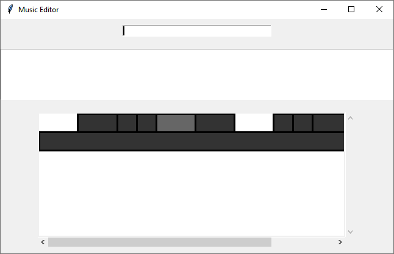

# User Guide

## How to Run

1. Ensure you have Python 3.10 or above.
1. Create a local fork of the repo.
1. Download the [Chrome WebDriver](https://googlechromelabs.github.io/chrome-for-testing/).
1. Place the Chrome WebDriver executable in the same directory as this README.
1. Run the `main.py` file. (For instance, by using `python main.py`.)

## Important Tips

- You can start from any of the given examples to make your own remix.
- You can use `config.py` to set the default file as the one you are working on, or simply use `open` to open your file.
- Keep your text editor open to edit the file.
- When you want to load the edited file into the program, use the `reload` command.

## UI Explanation

- As of the current version, the UI is intended to help you play the remix.
- The top textbox is for inputting commands.
- The next box stores command output information.
- The visualization shows when the tracks are playing in the remix. In the image, two tracks are shown, where the second track is played for a long time and the first one has many different sections.
  - You can select sections by clicking and run `play_section` to verify that you specified the correct section.

## Commands

### Playing Commands
- `play` Play your remix from the start.
- `play [time]` Play your remix from a certain time.
  - `play 10` Play your remix from 10 seconds in.
- `pause` Stop playing your remix.
- `play_section` Play the currently selected section.
- `skip_ad [video number]` Skip video ad.

### File Commands
- `open [file name]` to open file. Put the file name in quotes if there are spaces.
  - `open` opens a file picker.
- `save_as [file name]` to save the remix to a file. Put the file name in quotes if there are spaces.
  - `save_as` opens a file picker.
- `reload` to load changes from last opened file.
- `save` to save the remix to the last opened file.

### Other Commands
- `eval [expression]` Evaluate the given expression. No quotes should be used around the expression. The application basically evaluates the string from the 6th character.
- `exit` Quit the program.

## Data File Format

The data file is like a `JSON` file, but `Infinity` is an allowed value.
- `tracks`: A list of objects. A remix is made with several videos, each of which called a `Track`.
- `url`: A string for the URL to the video.
- `timing_offset`: A number for the first beat in the video, in seconds.
- `timing_sections`: A list containing lists of two elements. Each list of two elements consists of the number of beats, and a BPM. This represents that for the next given number of beats of the video, they are to be timed with the BPM provided.
- `data`: A list of objects that describe how to play the video in the remix. Each object describes a section of the song from when it starts to when it ends, known as a `TrackSection`. Sections should not overlap.
- `song_beat`: A number for the beat of the remix the section should start at.
- `start_beat`: A number for the beat of the video the section should start at.
- `duration_beats`: A number for the number of beats the video should be played for, according to the timing of the video.
- `track_beats_per_song_beat`: A number for how many video beats should correspond to a song beat. (This is not very rigourously tested.)
- `pitch`: A number for how many semitones the video should be tuned up.
- `volume`: A number from 0 to 1, for the volume of the video.
- `beat_timer`: Similar format to `timing_sections`, but this respresents the beats of the remix instead of the videos.

# Configuration

In `config.py`, you can set the following:
- Width and height of the windows
  - The program would automatically find values to help tile the screen with windows of at least that size. Note Chrome WebDriver windows are 500px wide.
- Default file
  - If this is a nonempty string, the program would automatically open that file on load.